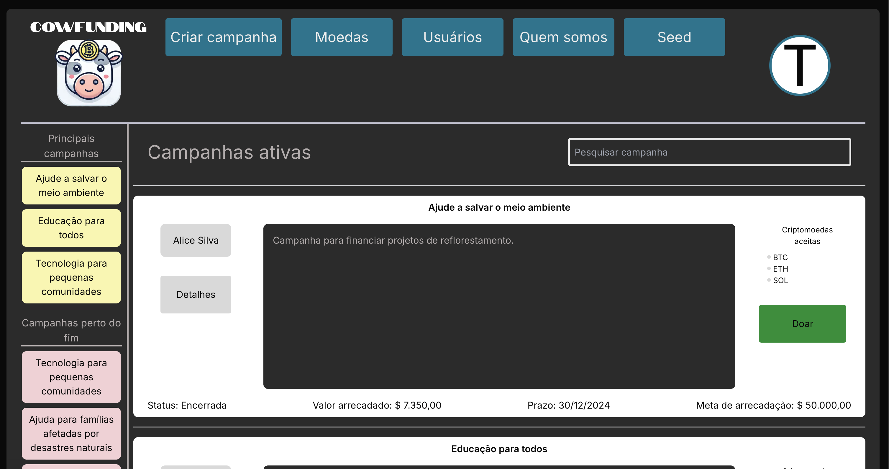
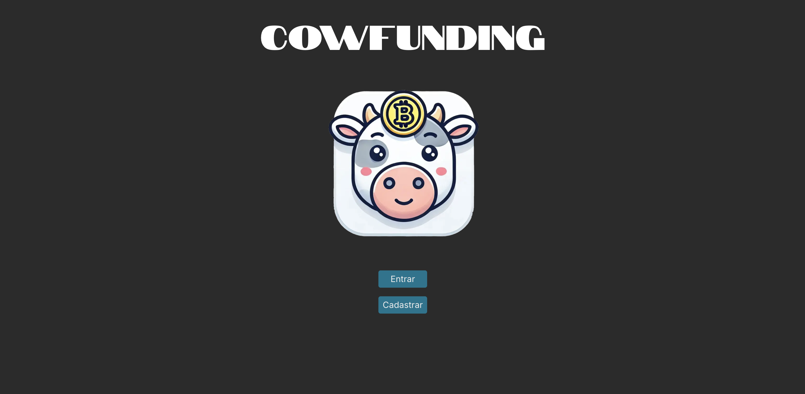

# Cowfunding

Cowfunding é um app web inspirado em plataformas de crowdfunding, com foco em campanhas de doação em criptomoedas.

Foi desenvolvido como trabalho final da disciplina de Engenharia de Software I.

Projeto em grupo. Implementação do app feita por mim. Design feito por outro membro do grupo.

## Demo

  
  

  Vídeo completo da demo na última <a href="https://github.com/SammuelGR/cowfunding/releases/latest" target="_blank">release</a>.

## Links

- Deploy https://cowfunding.vercel.app/
- Figma https://www.figma.com/design/XaudQXub9gJAJsIjtJDtxa/Cowfunding1

## Visão geral

A proposta é permitir criar e gerenciar campanhas de doação, definindo título, descrição, meta, prazo e moedas aceitas.

O projeto também tem uma área de cadastro de moedas e um backoffice básico para usuários.

## Primeiro uso

Ao abrir o site pela primeira vez, você cai na tela de login.

Depois de criar a conta e entrar, o sistema pode estar vazio.

Para ver o fluxo completo com dados, use o botão **Seed** no cabeçalho.

Se preferir preencher manualmente, cadastre uma moeda primeiro e depois crie uma campanha.

## Funcionalidades

- Login
- Seed de dados para popular moedas, usuários e campanhas
- Cadastro de moedas disponíveis na criação de campanhas
- Criação e gerenciamento de campanhas com meta, prazo e moedas aceitas
- Backoffice para moedas e usuários

## Stack

- Next.js
- React
- TypeScript
- Persistência simulada com localStorage
- Deploy na Vercel

## Rodando local

Pré-requisitos

- Node
- npm ou yarn

Passos

- `git clone https://github.com/SammuelGR/cowfunding`
- `cd cowfunding`
- `npm install` ou `yarn`
- `npm run dev` ou `yarn dev`

Abra em `http://localhost:3000`.

## Artefatos da disciplina

- A pasta `documentation` contém materiais exigidos na disciplina, incluindo um PDF com o DRE e um cronograma.
- Os testes foram implementados com Selenium WebDriver por requisito do professor.
